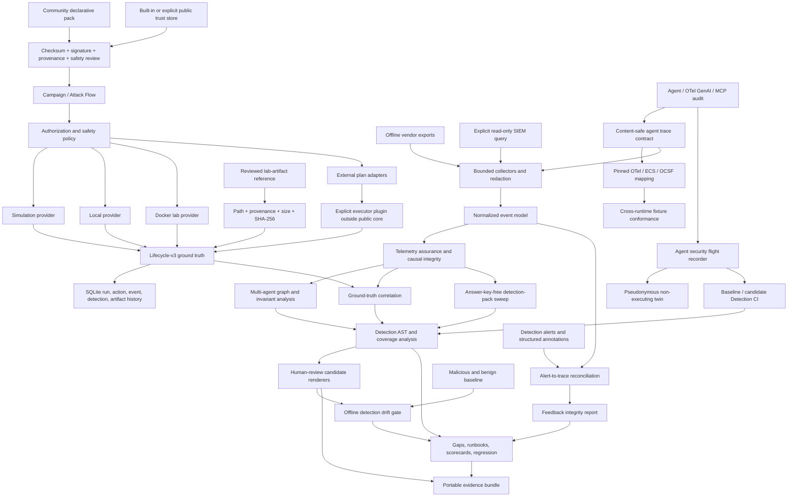

# AgentSim v1.7 architecture

AgentSim separates content, execution, authorization, telemetry, detection,
and defensive evaluation so synthetic traces cannot silently become executable
behavior and external integrations cannot bypass the public-core boundary.



## Package layout

```text
agentsim/
├── cli.py                 stable v1 CLI and legacy dispatch
├── api.py                 stable Python API
├── plugins.py             entry-point metadata and API 1.0 contracts
├── models/                ability, campaign, target, result, event, agent telemetry
├── content/               strict loaders, provenance, RSA trust, community review
├── orchestration/         directed planning and lifecycle runner
├── execution/             simulate, local, and Docker provider interfaces
├── external/              non-executing Atomic, Stratus, CALDERA plans
├── safety/                authorization, target scope, policy, limits, cleanup
├── telemetry/             contracts, mappings, conformance, flight recorder, collectors, assurance, investigation, connectors
├── detection/             graph-aware AST, packs, evaluator, coverage, generator, renderers
├── defense/               Detection CI, feedback, drift, recommendations, gaps, regression
├── lab/                   controls, reference agent, reviewed artifact references
├── reporting/             bundles and Attack Flow STIX interchange
└── web/                   packaged loopback Web entry point
```

The root `core.py`, `scenarios.py`, `tactics.py`, `mcp_lab.py`, and `web_ui.py`
remain compatibility surfaces. New automation should use `agentsim.cli` or
`agentsim.api`.

## Trust boundaries

### Scenario packs

Scenario packs are non-executing fixtures. Validators require action events to
set `attributes.executed: false`, restrict resources to synthetic/loopback
identifiers, reject prompt/token/payload recording, and prevent detectors from
reading ground-truth labels.

### Ability and campaign packs

Abilities reference reviewed `catalog://` argv; campaign steps reference
abilities. Unknown executable fields fail closed. Canonical SHA-256 digests
protect content arrays. Release-foundation content adds an RSA PKCS#1 v1.5
SHA-256 signature verified against `agentsim/content/trusted_keys.json`.

The endpoint/cloud control-validation preview is checksum protected,
visibly marked `checksum-review-preview`, restricted to the simulation
provider, network denied, production locked, and unable to change state. It is
not represented as release-signed executable content. A maintainer can promote
a reviewed preview pack only by signing it with the offline release key.

The signing private key is not distributed. Community packs must not claim
approval from a checksum alone. The v1.7 reviewer requires a trusted signature,
strict provenance, a valid pack shape, and a safety review. Explicit public
trust stores can add keys but cannot replace a built-in key ID. Provenance is
part of the signed payload, so a revision, source-path, authorship, license, or
review-record change invalidates the signature.

### External adapters and plugins

External adapters return a hashed `ExternalPlan`; they do not run a command or
make an HTTP request. Plans require exact semantic versions, typed identifiers,
explicit targets, and cleanup phases. CALDERA plans exclude credentials.

Plugin discovery reads entry-point metadata without importing code. Loading is
an explicit act and enforces plugin API `1.0`. An external executor is outside
the public core and must independently enforce authorization, version, target,
resource, cleanup, and evidence contracts.

The v1.7 lab-artifact reference binds a repository-relative file under an
explicit lab root to provenance, SHA-256, size, media type, artifact type,
platform, resource limits, an ephemeral-container requirement, and cleanup.
Review rejects traversal, symlinks, path escape, substitutions, and oversized
files. It streams a digest and never returns bytes. Script or executable types
remain inspection-only. URLs, downloads, raw bytes, shell fragments, unpinned
artifacts, production targets, and execution remain invalid in the public core.

### Live telemetry connectors

Live connectors are a narrow read-only exception to the public core's general
non-networking default. Building a plan never contacts a vendor. Execution
requires `--execute` plus `--allow-network`; exact datasets and targets are
mandatory; time, record, response, timeout, redirect, and TLS constraints are
enforced. Only a credential environment-variable name is serialized. The
credential value and request authorization header are never placed in the
plan, audit record, normalized events, or output artifact.

The connector boundary retrieves telemetry only. It cannot create, update,
deploy, or delete vendor detections, dashboards, indexes, users, or policies.

## Authorization and execution

Before preparation, the safety policy checks manifest expiration, mode, exact
target/CIDR, ability scope, provider compatibility, target type, production
lockout, elevation, network triple-consent, and cleanup metadata. Denied actions
still produce `planned`, `denied`, and `prevented` evidence.

`ExecutionProvider` exposes `prepare`, `execute`, and `cleanup`:

- Simulation validates lifecycle without starting a process.
- Local resolves static argv for an explicit localhost target.
- Docker uses static argv with `docker exec` against a named existing container.

Cleanup is called from a `finally` path. Kill-switch cancellation stops new
actions while keeping a separately bounded cleanup reserve.

## Telemetry and detection

Offline collectors read local JSON/JSONL exports, enforce a 256 MiB and 250,000
record limit, normalize known vendor fields, inventory available fields, and
discard fields whose names indicate prompts, credentials, secrets, tokens,
payloads, or authorization data.

Agent trace contract 1.1 adds stable correlation and authorization fields for
agent runtimes, OpenTelemetry GenAI spans, and MCP audit records. Raw prompts,
messages, tool arguments/results, and model responses are excluded by design.
Live connector responses pass through the same normalized/redacted event model.

Portable mappings project that contract to pinned OTel 1.43.0 semantic
conventions, ECS 9.4.0, or OCSF 1.8.0. Only defensible standard fields are
native; every remaining AgentSim security field is placed under an explicit
extension namespace. Importers prefer the extension for lossy enumerations and
restore bounded security attributes without content values. Conformance runs a
fixed reference fixture through map/import and compares identity, causality,
delegation, goal, memory, policy, trust, outcome, and safe attribute invariants.

The flight recorder consumes the same contract from exported records, OTLP
JSON, or an optional runtime processor. SDK processors select structural span
properties and never invoke a general span exporter that may serialize
content. The loopback OTLP JSON receiver requires an explicit opt-in and has no
outbound path. Flight bundles are strict, bounded, digest protected, and always
declare that content values were not recorded. Synthetic twins pseudonymize
identities and set `executed: false`.

Telemetry assurance runs before interpretation. It checks source timestamps,
stable record IDs, native agent identities, causal edge resolution, cross-trace
links, temporal inversions, and the content-redaction boundary. It never reads
or emits prompt/tool content. A degraded or unusable report is evidence about
observability quality, not evidence that an attack occurred.

The detection AST is data, not executable code. Evaluation is deterministic and
bounded. Regex values are length-limited; evidence is capped and contains only
record identity, time, source, type, and synthetic status. Grouping prevents
cross-host or cross-principal sequence matches.

Candidate generation uses reviewed ability metadata and static command names.
It does not inspect raw command output or deploy a rule. Rendered content is
marked experimental/candidate and includes known limitations.

Detection packs are strict JSON data. The loader rejects answer-key fields,
duplicate rule IDs, undeclared rule fields, unknown pack fields, oversized
packs, and executable expressions. A sweep reports `detected`,
`not_detected`, or `visibility_gap`; it does not claim malicious/benign ground
truth and does not deploy vendor content.

Multi-agent investigation consumes only normalized content-safe events. It
constructs bounded nodes and parent, caused-by, delegation, data-lineage, and
memory-lineage edges. Invariants evaluate delegation endpoints, principal
continuity, agent handoffs, goal fingerprints, memory provenance, and retention
scope. Findings contain field-level evidence, remediation, and a bounded causal
path. The Web workbench is a renderer over this report; it cannot upload
telemetry or execute an action.

`graph_path` and `graph_fanout` extend the declarative AST without evaluating
code. They traverse only explicit source record IDs, accept configured link
fields, enforce depth 1–50, and remain inside the rule's grouping boundary.

Detection feedback is also treated as untrusted structured data. The bundle
accepts alerts plus enumerated annotations and rejects unknown/free-form
fields. Reconciliation uses explicit trace IDs and stable record IDs; it does
not inspect prompts, arguments, results, or message text. Agent-authored final
verdicts, evidence-digest mismatch, unresolved evidence, contradictory
dispositions, and high-risk trace dismissal become explicit findings rather
than silent tuning inputs.

Detection drift compares typed malicious/benign snapshots. It derives
precision, recall, false-positive and benign-rejection rates, reconciliation
coverage, and checkpoint latency, then applies caller-selected thresholds.
Reports are advisory artifacts: no code path promotes or deploys a candidate
or changes a suppression.

Detection CI compares reviewed and candidate flight bundles. It runs assurance,
investigation invariants, and answer-key-free pack rules on both sides, then
classifies lost malicious coverage, new benign detections, visibility gaps,
checkpoint loss, and invariant regressions. JSON, Markdown, JUnit, and SARIF
are advisory artifacts; the gate cannot mutate an agent or vendor rule.

## Persistence and evidence

SQLite stores immutable manifest JSON/hash, action results, append-only
lifecycle events, detection evaluations, artifact metadata, and redacted live
query audits. Only final run status/summary fields and explicit post-run
detection counters are updated.

The v1 evidence ZIP contains the manifest, lifecycle JSONL, campaign report,
scorecard, runbooks, candidate detections, and Attack Flow export. Process
output is reduced to return codes, byte count, and SHA-256 digest before any
evidence is persisted.

The public schemas are in [schemas](schemas/), including normalized events,
detection rules, external plans, agent trace events, live query plans,
reference-lab results, telemetry-assurance, multi-agent investigation,
detection-feedback, detection-drift, flight-recorder, and detection-CI reports,
detection packs and sweep reports, signed packs, content provenance, portable
mappings, runtime conformance, community review, lab-artifact references and
reviews, authorization, and lifecycle v3.
