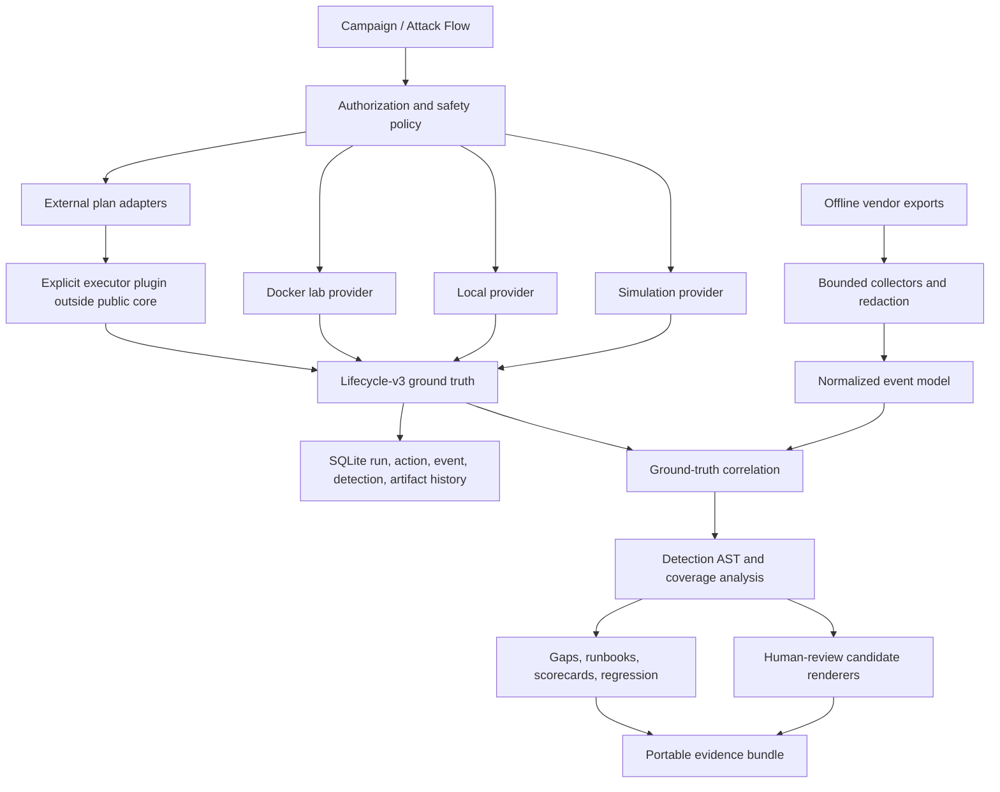

# AgentSim v1 architecture

AgentSim separates content, execution, authorization, telemetry, detection,
and defensive evaluation so synthetic traces cannot silently become executable
behavior and external integrations cannot bypass the public-core boundary.



## Package layout

```text
agentsim/
├── cli.py                 stable v1 CLI and legacy dispatch
├── api.py                 stable Python API
├── plugins.py             entry-point metadata and API 1.0 contracts
├── models/                ability, campaign, target, result, event, telemetry
├── content/               strict loaders, integrity, RSA trust, signed content
├── orchestration/         directed planning and lifecycle runner
├── execution/             simulate, local, and Docker provider interfaces
├── external/              non-executing Atomic, Stratus, CALDERA plans
├── safety/                authorization, target scope, policy, limits, cleanup
├── telemetry/             ground truth, normalization, collectors, correlation
├── detection/             AST, evaluator, coverage, generator, renderers
├── defense/               recommendations, gaps, runbooks, regression, scorecard
├── lab/                   disposable in-memory agentic control fixtures
├── reporting/             bundles and Attack Flow STIX interchange
└── web/                   packaged loopback Web entry point
```

The root `core.py`, `scenarios.py`, `tactics.py`, `mcp_lab.py`, and `web_ui.py`
remain compatibility surfaces. New automation should use `agentsim.cli` or
`agentsim.api`.

## Trust boundaries

### Scenario packs

Scenario packs are non-executing fixtures. Validators require action events to
set `attributes.executed: false`, restrict resources to synthetic/loopback
identifiers, reject prompt/token/payload recording, and prevent detectors from
reading ground-truth labels.

### Ability and campaign packs

Abilities reference reviewed `catalog://` argv; campaign steps reference
abilities. Unknown executable fields fail closed. Canonical SHA-256 digests
protect content arrays, and built-in content adds an RSA PKCS#1 v1.5 SHA-256
signature verified against `agentsim/content/trusted_keys.json`.

The signing private key is not distributed. Third-party packs may use checksum
integrity without claiming AgentSim trust; deployments can maintain their own
review/signing pipeline rather than modifying the built-in trust key.

### External adapters and plugins

External adapters return a hashed `ExternalPlan`; they do not run a command or
make an HTTP request. Plans require exact semantic versions, typed identifiers,
explicit targets, and cleanup phases. CALDERA plans exclude credentials.

Plugin discovery reads entry-point metadata without importing code. Loading is
an explicit act and enforces plugin API `1.0`. An external executor is outside
the public core and must independently enforce authorization, version, target,
resource, cleanup, and evidence contracts.

## Authorization and execution

Before preparation, the safety policy checks manifest expiration, mode, exact
target/CIDR, ability scope, provider compatibility, target type, production
lockout, elevation, network triple-consent, and cleanup metadata. Denied actions
still produce `planned`, `denied`, and `prevented` evidence.

`ExecutionProvider` exposes `prepare`, `execute`, and `cleanup`:

- Simulation validates lifecycle without starting a process.
- Local resolves static argv for an explicit localhost target.
- Docker uses static argv with `docker exec` against a named existing container.

Cleanup is called from a `finally` path. Kill-switch cancellation stops new
actions while keeping a separately bounded cleanup reserve.

## Telemetry and detection

Collectors read only local JSON/JSONL exports, enforce a 256 MiB and 250,000
record limit, normalize known vendor fields, inventory available fields, and
discard fields whose names indicate prompts, credentials, secrets, tokens,
payloads, or authorization data.

The detection AST is data, not executable code. Evaluation is deterministic and
bounded. Regex values are length-limited; evidence is capped and contains only
record identity, time, source, type, and synthetic status. Grouping prevents
cross-host or cross-principal sequence matches.

Candidate generation uses reviewed ability metadata and static command names.
It does not inspect raw command output or deploy a rule. Rendered content is
marked experimental/candidate and includes known limitations.

## Persistence and evidence

SQLite stores immutable manifest JSON/hash, action results, append-only
lifecycle events, detection evaluations, and artifact metadata. Only final run
status/summary fields are updated.

The v1 evidence ZIP contains the manifest, lifecycle JSONL, campaign report,
scorecard, runbooks, candidate detections, and Attack Flow export. Process
output is reduced to return codes, byte count, and SHA-256 digest before any
evidence is persisted.

The public schemas are in [schemas](schemas/), including normalized events,
detection rules, external plans, signed packs, authorization, and lifecycle v3.
