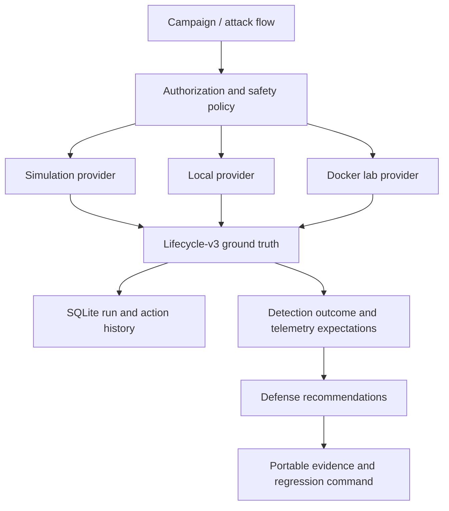

# AgentSim architecture

AgentSim 0.4.0 separates attack content, execution, authorization, evidence,
and defensive evaluation so synthetic test data can never silently become
executable content.



## Package layout

```text
agentsim/
├── cli.py                 v0.4 commands and legacy dispatch
├── api.py                 Python campaign API
├── models/                ability, campaign, target, event, and result models
├── content/               strict loaders, integrity, packs, campaigns, catalogs
├── orchestration/         planning and lifecycle runner
├── execution/             provider interface plus simulate/local/docker
├── safety/                authorization, target scope, policy, and limits
├── telemetry/             lifecycle-v3 JSONL persistence
├── defense/               evidence-backed recommendations
├── reporting/             portable campaign evidence bundles
├── detection/             reserved package boundary for v0.5
└── web/                   packaged Web entry point
```

The root `core.py`, `scenarios.py`, `tactics.py`, `mcp_lab.py`, and `web_ui.py`
modules remain as compatibility surfaces. `tactics.py` now derives the legacy
random simulator view from the reviewed v0.4 command catalog.

## Content boundaries

### Scenario packs

Scenario packs are synthetic evaluation fixtures. Validation requires proposed
action events to set `attributes.executed: false`, limits resources to
synthetic or loopback URIs, rejects payload and token recording, and prevents
reference detectors from reading ground-truth labels.

### Ability packs

An ability defines exactly one bounded behavior. It contains risk, supported
providers and targets, a `catalog://` command reference, cleanup metadata,
expected telemetry, detection objectives, benign controls, and defenses.
Ability files cannot contain command, script, payload, shell, or download
fields.

Pack checksums cover the canonical `abilities` array and are mandatory. The
reviewed command catalog has a separate mandatory checksum so changing a static
argv sequence cannot preserve the ability-pack digest. Optional signature
verification can be layered over the same canonical digests in a later release.

### Campaign packs

A campaign contains ability IDs and already-declared dependencies. The loader
rejects unknown/later dependencies and executable fields. Execution also
rejects campaigns whose ability references cannot be resolved.

## Authorization flow

Before preparation, the central safety policy verifies:

1. the manifest has not expired;
2. the selected mode is authorized;
3. the exact target or CIDR is allowlisted (wildcards are not accepted);
4. the ability ID is in scope;
5. the provider and target type are supported;
6. production is allowed by the ability;
7. elevation is not requested;
8. network use is approved by ability, run, and manifest; and
9. state-changing content declares cleanup.

Denied actions still produce `planned`, `denied`, and `prevented` evidence but
never reach provider preparation.

## Execution providers

`ExecutionProvider` exposes `prepare`, `execute`, and `cleanup`.

- `simulate` validates the content and lifecycle without starting a process.
- `local` accepts only `localhost://` and resolves static argv for the detected
  operating system.
- `docker` accepts only `docker://<name>` and uses static argv through
  `docker exec`; it never pulls or chooses an image.

The runner invokes cleanup in a `finally` path. Read-only abilities produce a
verified no-op cleanup record. State-changing abilities are rejected at load
and authorization time if they do not include a cleanup reference.
Kill-switch cancellation stops subsequent actions and emits a `cancelled`
lifecycle state. A separately counted, bounded cleanup-process reserve remains
available after cancellation so cleanup is attempted rather than blocked by
the kill switch.

## Lifecycle and persistence

[`schemas/action-event-v3.schema.json`](schemas/action-event-v3.schema.json)
defines the common ground truth. Each action has globally ordered immutable
events linked by `parent_event_id`.

SQLite stores:

- the immutable serialized manifest and its SHA-256;
- one result per action; and
- append-only lifecycle events keyed by run and sequence.

Only final run status and summary fields are updated. Raw process output is not
stored. Provider evidence includes return codes, output byte count, and digest.

## Compatibility and roadmap

Scenario schema v2 remains unchanged because it is a different, strictly
non-executing contract. Lifecycle schema v3 applies to ability and campaign
runs.

Version 0.5 is expected to add offline collectors, field/sensor coverage,
temporal and graph detector ASTs, candidate rule rendering, and automated
detection-gap analysis on top of the v0.4 timeline.
